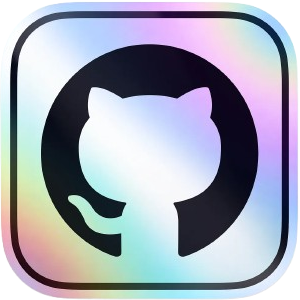
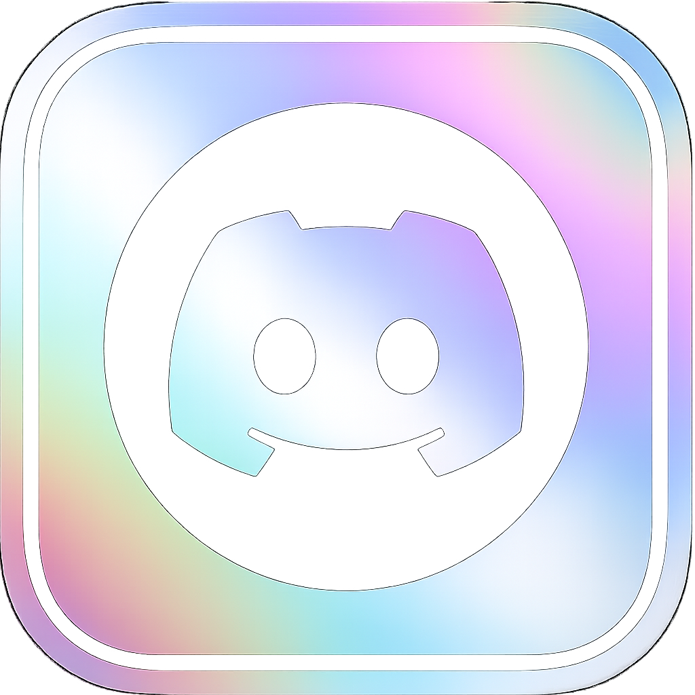
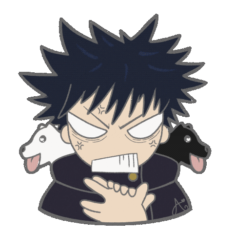

    

<!--Pulsating blue border-->

    

    

Hi, I’m Rishi, a student at BMS College of Engineering.  
This GitHub is mainly for my **college projects and submissions**.  

I’ve worked with **HTML, CSS, JavaScript, Java, Python, and C**.  

In Python, I’ve built things like image generation scripts, Discord bots, an AI chatbot,  
an OTP authentication system, auto logging application and some web scraping tools.  

Worked with libraries like Flask, Discord.py, Google APIs, BeautifulSoup, Requests, Pillow,
Aiohttp and Asyncpraw.

<!--Pulsating blue border-->

    

